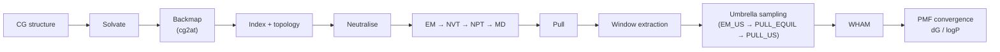

<h1 align="center">bilesalt</h1>

<p align="center">
  <b>Automated GROMACS workflows for bile-salt / peptide systems:<br>
  coarse-grained → atomistic backmapping, umbrella sampling and logP convergence analysis</b>
</p>

<p align="center">
  
  
  
  
  
</p>

`bilesalt` turns a short, declarative job file into a complete simulation campaign: it builds a
bile-salt / phospholipid aggregate with the peptide drug octreotide, **backmaps it from coarse-grained to
atomistic resolution** with [`cg2at`](https://github.com/owenvickery/cg2at), equilibrates it, and then runs
umbrella-sampling free-energy calculations and convergence analysis. Fed/fasted mixtures, replicas and
mutants differ by only a few lines of configuration.



## Features

| Capability | Where |
|---|---|
| Declarative job files (`sys` / `molecule` / `stage` / `slurm` blocks) with validation | `bilesalt.config` |
| **CG → AA backmapping** through [`cg2at`](https://github.com/owenvickery/cg2at) | `bilesalt.backmapping`, `System.setup` |
| Molecule insertion, solvation, neutralisation, index and topology generation | `bilesalt.molecules`, `box`, `topology`, `gromacs` |
| Bundled MDP templates (EM / NVT / NPT / MD / pulling / umbrella) with per-stage overrides | `bilesalt/data/mdp`, `bilesalt.mdp` |
| Umbrella sampling: window selection from a pulling run and Slurm fan-out | `bilesalt.stages`, `bilesalt.slurm` |
| Post-processing registry (energies, clustering, SASA, gyration, aspect ratio, contacts, ...) with plots | `bilesalt.analysis` |
| `gmx wham` job generation for every umbrella window set | `bilesalt wham` |
| Block / cumulative PMF convergence with drift tests and logP conversion | `bilesalt pmf-convergence` |

## Installation

Requirements: Python ≥ 3.9, [GROMACS](https://www.gromacs.org) on `PATH` (tested with 2025.2), and for
backmapping `cg2at` (`conda install -c conda-forge cg2at` or from its repository).

```bash
git clone <this repository> && cd BileSaltPipelineCode
pip install -e ".[analysis]"      # add ,dev for pytest and ruff
bilesalt --version
```

## Quick start (runs in seconds, no HPC needed)

```bash
bilesalt demo ./demo_run
```

This builds a small ionic water box from force-field files shipped with GROMACS and takes it through
molecule insertion, solvation, indexing, topology generation, neutralisation, energy minimisation and
NVT. Inspect `demo_run/demo_job.txt` for a minimal complete job file.

Run an analysis on the result:

```bash
cat > demo_analysis.txt <<'END'
system
resultFolder = ./demo_run/output
end

stage_1
name = EM_AA
analysis = potential
end
END
bilesalt analyze demo_analysis.txt      # writes potential.xvg / potential.png into demo_run/output/EM_AA
```

## Real workflow

```bash
bilesalt validate examples/jobs/FAST_NATC_1.txt   # parse and print the planned workflow
bilesalt run examples/jobs/FAST_NATC_1.txt        # execute it
bilesalt submit path/to/jobs/ --partition batch   # one Slurm job per *.txt file
```

`examples/jobs/FAST_NATC_1.txt` is the full backmapping workflow: a `CG` system rebuilds and backmaps a
previous coarse-grained run, an `AA` system inserts octreotide and runs EM → NVT → NPT → MD.
`examples/jobs/umbrella_sampling_template.txt` shows the pulling / umbrella stages. The complete key
reference is in [docs/job-format.md](docs/job-format.md); the design is described in
[docs/architecture.md](docs/architecture.md).

### Backmapping

A system with `cg2at = CG` is solvated (optionally), converted to atomistic coordinates by
`cg2at`, and then indexed, given a topology and neutralised exactly like an atomistic system.
The interactive `cg2at` menu answers, the fragment-overlap cut-off and the executable are configurable per
system (`cg2at_answers`, `cg2at_overlap`, `cg2at_executable`); the converted structure becomes the starting
point of every following stage.

### Output layout

```
<output_dir>/<system>/setup/   forcefield/ itp/ molecules/ topol.top index.ndx solvated.gro ionized.gro
<output_dir>/<system>/backmap/ FINAL/final_cg2at_de_novo.pdb          (backmapped systems)
<output_dir>/<STAGE>/          <STAGE>.mdp .tpr .gro .xtc .edr        (one directory per stage)
```

### Analysis

`bilesalt analyze plan.txt` runs the commands listed under `analysis =` for each stage, writes the raw
data and a PNG per command, and pickles everything into `collection.pkl`. Registered commands:
`potential temperature pressure gyrate density sasa sasaHP sasaHD aspectRatio cleanUp prettyView
clusOverTime pbcNOJUMP radial setRegions contactAnalysis SASA_RES HBA_RES convertTpr extractLargest trim
newTPR`.

### Free energies and logP

```bash
bilesalt wham /path/to/windows --dry-run      # preview gmx wham jobs for every US_*/PULL_US directory
bilesalt pmf-convergence --blocks 5 --mode both --t-start 1000 --t-end 80000 \
         --region-a 4 4.5 --region-b 0 0.6 --units kJ
```

`pmf-convergence` solves WHAM on disjoint time blocks and cumulative windows, tests for drift, reports
dG / logP with errors and estimates the sampling needed for a target precision (`--wham internal` runs
without GROMACS). See the module docstring for the statistics.

## Testing

```bash
pip install -e ".[analysis,dev]"
pytest
```

The suite covers configuration parsing, MDP handling, window selection, Slurm script generation,
backmapping (with a stand-in `cg2at`), the PMF statistics, and — when `gmx` is available — real
end-to-end GROMACS runs (setup, topology, neutralisation, EM, NVT, energy analysis).

## Repository layout

```
src/bilesalt/      package (pipeline, analysis, logp)
examples/          job files, analysis plan, logP data
tests/             pytest suite
docs/              job-file reference and architecture notes
```

## License

MIT — see [LICENSE](LICENSE).
